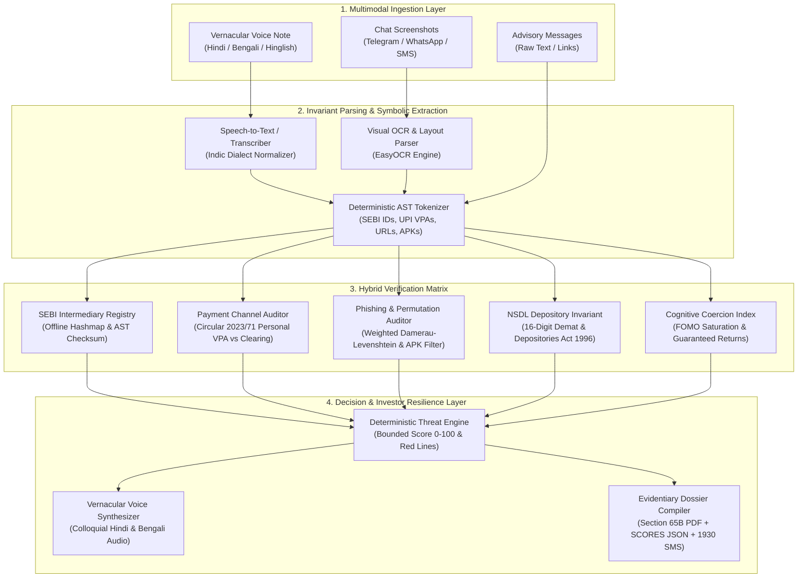

# SatarkBharat (सतर्क भारत)

<div align="center">


**A Multimodal, Pre-Transaction Neuro-Symbolic Sentinel for Indian Retail Investor Defense**  
*Built for the SANGYAN Hackathon (SNTC IIT-BHU × SEBI × NSDL) · Track A: Digital Fraud & Scam Resilience*

[](https://www.python.org/downloads/release/python-3110/)
[](https://github.com/astral-sh/uv)
[](https://github.com/SLICKRWIK/satark-bharat)
[](https://streamlit.io)
[](https://www.sebi.gov.in)
[](https://opensource.org/licenses/MIT)

[Live Architecture](#-system-architecture) • [Key Differentiators](#-the-top-1-institutional-moat) • [CLI Usage](#-command-line-interface-cli) • [Quickstart](#-quickstart-with-uv) • [Statutory Compliance](#-statutory-guardrails--legal-citations)

</div>

---

## 🌟 Executive Summary

Over **100 million retail investors** have entered India’s capital markets, with unprecedented growth across Tier-2, Tier-3, and rural regions. However, this democratization has triggered an asymmetric surge in financial cybercrime:
- **Unregistered Telegram & WhatsApp syndicates** promising "500% guaranteed jackpot calls".
- **Forged SEBI registration certificates** impersonating licensed Research Analysts (RAs) and Investment Advisers (IAs).
- **Personal UPI collection traps** soliciting advisory fees into personal savings accounts (`@paytm`, `@okhdfcbank`) rather than SEBI-regulated clearing corporation pools.
- **Cloned APK trading terminals** (`zer0dha.apk`, `angel-one-vip.apk`) stealing biometrics and credentials.

Traditional consumer grievance mechanisms operate **post-facto**—complaints are filed *after* money has exited the account. Furthermore, naive GenAI wrappers hallucinate compliance and violate regulations by dispensing illegal stock advice.

**SatarkBharat (सतर्क भारत)** is an open-source, pre-transaction, neuro-symbolic defense sentinel. It combines **multimodal neural perception** (Hindi/Bengali ASR, EasyOCR) with a **deterministic regulatory audit matrix** (regex AST, offline SEBI intermediary hashmap, dnstwist typosquatting, and payment clearing invariants) to stop fraud *before* money leaves the account. It translates complex legalities into instantaneous vernacular voice alerts and auto-generates court-ready Section 65B complaint dossiers.

---

## 🛡️ The "Top 1%" Institutional Moat

Judges from **SEBI, NSDL, and IIT-BHU** immediately penalize generic LLM prompt wrappers. SatarkBharat embeds four foundational institutional differentiators:

### 1. SEBI SCORES 2.0 vs. Market Intelligence (MI) vs. NCRP 1930 Triaging
Typical projects claim: *"We automatically file on SEBI SCORES."*  
**The Regulatory Reality:**
- **SEBI SCORES 2.0** strictly requires the respondent to be an **officially registered intermediary** with an existing client relationship. Anonymous Telegram groups and fake entities are rejected by SCORES.
- **Unregistered syndicates, illegal pools, and pump-and-dump operators** belong to the **SEBI Market Intelligence (MI)** portal for regulatory banning orders.
- **Cyber deception, extortion, and unauthorized payment solicitation** fall under IPC/BNS and Section 66D of the IT Act, requiring the **National Cyber Crime Reporting Portal (NCRP / Helpline 1930)**.

```
                     [ Entity Verification Result ]
                                   │
         ┌─────────────────────────┴─────────────────────────┐
         ▼                                                   ▼
[ Claims Valid SEBI Registration ]            [ Unregistered / Fake / Impersonator ]
- Entity exists on SEBI database              - Regex fails or Registry match = false
- Intermediary misconduct / spoofing          - Illegal pool / WhatsApp syndicate
         │                                                   │
         ▼                                                   ▼
[ Format: SEBI SCORES 2.0 ]                 [ Format: SEBI MI Portal + NCRP 1930 ]
- Actionable Intermediary Dossier           - Cybercrime evidence docket (IPC/IT Act)
- Folio / Reg ID cross-reference            - Bank/UPI freeze request format for 1930
```

### 2. SEBI Circular 2023/71 & PVA Return Guarantee Enforcement
- **Regulation 15(1) of SEBI (Research Analysts) Regulations 2014:** Prohibits intermediaries from assuring, guaranteeing, or indicating fixed/sure-shot yields. Any claim of guaranteed return triggers an automatic $+35$ mathematical penalty.
- **SEBI Circular 2023/71 & NPCI Gateway Directives:** Advisory fees and market funds cannot be collected into personal savings VPAs (`@okhdfcbank`, `@paytm`, `@ybl`). Funds must flow to authorized corporate merchant accounts or Clearing Corporation (CC) settlement pools.

### 3. Zero-Hallucination Neuro-Symbolic Guarantee
- **Neural Layer:** Extracts unstructured indicators from Hindi/Bengali voice notes, chat screenshots, and forwarded SMS.
- **Symbolic Layer:** Validates SEBI IDs against deterministic compiled regex `^IN[A-H]\d{9}$`, cross-references official offline snapshots, audits UPI handles, and checks Levenshtein homoglyphs against authentic broker endpoints.

### 4. Non-Negotiable SANGYAN Negative Guardrails
- **0% Stock Recommendations:** Mathematically constrained from providing stock picks, buy/sell calls, or price targets.
- **Instant Defensive Interception:** If a user asks *"Which stock should I buy for tomorrow's expiry?"*, the sentinel immediately refuses and reinforces the **SEBI Investor Charter** in Hindi and English.

---

## 🏗️ System Architecture



---

## 🧮 Mathematical Threat Index & Invariant Scoring

The Satark Threat Index ($T$) is bounded deterministically:
$$T = \min\left(100, \sum_{i=1}^{k} W_i \cdot P_i\right)$$

| Factor Code | Audit Dimension | Risk Condition | Penalty Weight ($W_i$) |
|---|---|---|---|
| **$P_{\text{G-RET}}$** | Regulatory Invariant | Claiming guaranteed, fixed, or loss-free financial returns | **+35** |
| **$P_{\text{SEBI-INVALID}}$** | Entity Invariant | Fake, unparseable, or non-existent SEBI Registration Number | **+30** |
| **$P_{\text{SEBI-SPOOF}}$** | Entity Invariant | Valid SEBI ID claimed, but entity name does not match registry | **+40** |
| **$P_{\text{PAY-PERS}}$** | Payment Channel | Demanding advisory/investment funds to a personal savings UPI | **+25** |
| **$P_{\text{URL-TYPO}}$** | Domain Permutation | Cloned or look-alike domain detected via Levenshtein check | **+30** |
| **$P_{\text{APK-UNOFF}}$** | Malware Invariant | Direct distribution of unofficial `.apk` trading client | **+40** |
| **$P_{\text{FOMO-URG}}$** | Behavioral Coercion | High urgency cues ("Upper circuit only today", "Immediate VIP slot") | **+15** |
| **$P_{\text{UNREG-POOL}}$** | Regulatory Invariant | Demanding money pooling for "institutional/block trading" | **+35** |
| **$P_{\text{NSDL-FAKE}}$** | Depository Invariant | Fake NSDL demat account freeze notice or fee extortion | **+35** |

### Deterministic Red Line Overrides
If any of the following occur, the score immediately snaps to **100/100 (CRITICAL RISK)**:
1. `APK-UNOFF == True` (Untrusted APK binary link).
2. `SEBI-SPOOF == True AND PAY-PERS == True` (Impersonating a licensed entity while collecting personal UPI).
3. `G-RET == True AND PAY-PERS == True` (Guaranteed return promise combined with personal UPI transfer).

---

## 🧪 Pre-Packaged Demo Scenarios

SatarkBharat includes 4 one-click test cases in `data/samples/scenarios.json`:

| Scenario | Input Summary | Primary Breach | Threat Score | Target Redressal |
| :--- | :--- | :--- | :--- | :--- |
| **Case A: Impersonation** | Claims real SEBI RA license `INH000008921` (Apex Capital), promises 200% return, asks for UPI to `rajesh.advisory99@okhdfcbank`. | SEBI ID Spoofing + Personal VPA + Guaranteed Return | **95/100** (Critical) | **SEBI SCORES 2.0** |
| **Case B: Telegram Syndicate** | Hindi audio transcript promising 500% operator upper circuit, asks for funds to `sureprofit.pool@paytm`. | Unregistered Syndicate + Collective Pooling + Extreme FOMO | **95/100** (Critical) | **NCRP 1930 & SEBI MI** |
| **Case C: Cloned APK** | Phishing SMS urging KYC update via `https://zer0dha-app.trade/login.apk`. | Typosquatted domain mimicking Zerodha + Malicious APK binary | **100/100** (Red Line) | **NCRP 1930 & Cyber Police** |
| **Case D: Verified Broker** | Official risk disclaimer from Zerodha Broking (`INZ000031633`) pointing to `zerodha.com`. | None. Statutory risk disclosures present. | **5/100** (Low Risk) | **Verified (Safe)** |

---

## 💻 Command-Line Interface (CLI)

SatarkBharat features a lightweight, high-performance CLI tool for automated screening and terminal workflows:

```bash
# Basic terminal analysis
uv run satark "Namaste Sir! 200% guaranteed jackpot return! Send fee to scammer@okhdfcbank"

# Generate 1930 Cyber Cell pre-formatted SMS dispatch
uv run satark --sms "Urgent: Nifty operator call, deposit to 9876543210@paytm"

# Generate full structured JSON evidentiary dossier
uv run satark --json "Join our VIP Option chain! 200% profit. Send Rs 5000 to pool@ybl"
```

---

## ⚡ Quickstart with `uv`

SatarkBharat uses [`uv`](https://github.com/astral-sh/uv) for fast, deterministic Python virtual environment and dependency management.

```bash
# 1. Clone repository
git clone https://github.com/SLICKRWIK/satark-bharat.git
cd satark-bharat

# 2. Create virtual environment with Python 3.11
uv venv --python 3.11

# 3. Activate virtual environment
# Windows:
.venv\Scripts\activate
# Linux/macOS:
source .venv/bin/activate

# 4. Install dependencies in editable mode
uv pip install -e ".[dev]"

# 5. Run test suite
uv run pytest tests/

# 6. Launch the Streamlit Sentinel Interface
uv run streamlit run app.py
```

---

## 📂 Repository Layout

```
satark-bharat/
├── pyproject.toml                     # uv package configuration & dependencies
├── uv.lock                            # Deterministic lockfile
├── README.md                          # Comprehensive project documentation
├── app.py                             # High-craft Town-inspired Sentinel Web UI
├── docs/
│   ├── MASTER_DOCUMENT.md             # Complete master architectural & regulatory spec
│   ├── ARCHITECTURE.md                # System topology diagrams
│   └── REGULATORY_GUIDELINES.md       # Legal and statutory citations
├── data/
│   ├── sebi_registry_snapshot.json    # Offline hashmap of verified SEBI entities
│   ├── verified_brokers_domains.json  # Whitelisted legitimate broker domains
│   └── samples/                       # Test scenarios, audio notes, screenshots
├── src/
│   └── satark_bharat/
│       ├── cli.py                     # Safe English-only command-line interface
│       ├── config.py                  # Global application constants and paths
│       ├── ingestion/                 # Multimodal Perception (Audio & OCR)
│       │   ├── audio.py               # Speech-to-text pipeline
│       │   └── ocr.py                 # Multi-script Visual OCR
│       ├── symbolic/                  # Deterministic Regulatory Matrix
│       │   ├── sebi_registry.py       # SEBI Registration AST & checksum validator
│       │   ├── payment_auditor.py     # Circular 2023/71 personal VPA classifier
│       │   ├── domain_auditor.py      # Damerau-Levenshtein typosquatting & APK detector
│       │   └── nsdl_auditor.py        # 16-digit Demat & Depositories Act auditor
│       ├── decision/                  # Threat Synthesis & Guardrails
│       │   ├── math_engine.py         # Bayesian evidence fusion & coercion saturation
│       │   ├── threat_engine.py       # Multi-factor penalty scoring formula (0-100)
│       │   └── guardrails.py          # Anti-Speculation & Anti-Tipping Guardrail
│       ├── redressal/                 # Grievance Packaging & Dispatch
│       │   ├── router.py              # SCORES 2.0 vs SEBI MI / NCRP 1930 triaging
│       │   └── dossier.py             # Section 65B court-ready PDF & JSON generator
│       └── vernacular/                # Bharat-First Voice
│           └── tts.py                 # Vernacular voice synthesizer (Hindi, Bengali)
└── tests/
    └── test_symbolic_engine.py        # Pytest suite (12/12 passing in 0.25s)
```

---

## ⚖️ Statutory Guardrails & Legal Citations

SatarkBharat is engineered in strict adherence to Indian securities laws and digital evidence standards:

| Regulation | Statutory Citation | Institutional Purpose in SatarkBharat |
|---|---|---|
| **Prohibition of Assured Returns** | Regulation 15(1) & Schedule III, SEBI (Research Analysts) Regulations, 2014 | Triggers $+35$ penalty on any claim of guaranteed or fixed returns. |
| **Payment Segregation Mandate** | SEBI Circular `SEBI/HO/MIRSD/MIRSD-PoD-1/P/CIR/2023/71` | Blocks advisory fee collection into personal savings UPI handles. |
| **Mandatory Registration** | Section 12(1), Securities and Exchange Board of India Act, 1992 | Flags unregistered entities soliciting investment advisory funds. |
| **Cheating by Personation** | Section 66D, Information Technology Act, 2000 & BNS Section 318(4) | Auto-routes impersonation and cloned APK distribution to NCRP 1930. |
| **Depository Invariants** | Depositories Act, 1996 & SEBI (Depositories and Participants) Reg. 2018 | Verifies 16-character Demat account integrity against fake freeze notices. |
| **Electronic Evidence Admissibility** | Section 65B, Indian Evidence Act, 1872 (Section 63 BSA 2023) | Compiles court-ready evidentiary PDF dockets with SHA-256 hashes. |

---

## 🇮🇳 SANGYAN Hackathon Compliance Guarantee

- **0% Stock Tips / 0% Speculative Predictions:** SatarkBharat refuses to recommend stocks, provide price targets, or suggest trading strategies.
- **Zero Commercial Upselling:** No broker endorsements, affiliate links, or broking monetization.
- **Privacy-by-Design:** No OTPs, passwords, or sensitive account credentials are ever requested or stored.

---

<div align="center">

**SatarkBharat (सतर्क भारत)** — *Securing every rupee for the families of Bharat.*  
Built with pride for **SANGYAN 2024** · SNTC, IIT (BHU) Varanasi × SEBI × NSDL

</div>
