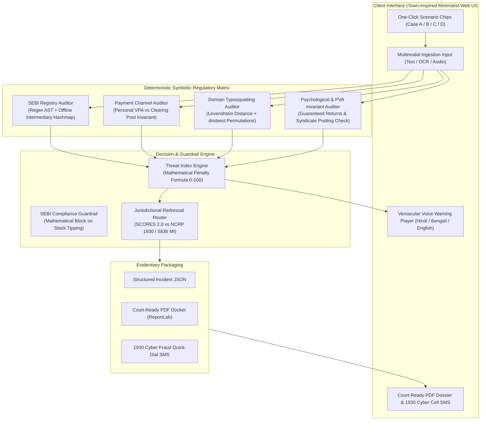

# SatarkBharat — System Architecture & Data Flow

---

## Component Descriptions

1. **`satark_bharat.symbolic.sebi_registry`**: Deterministic verification of alphanumeric SEBI codes (`INH`, `INA`, `INZ`, `INM`, `INP`, `MF`). Validates existence against `sebi_registry_snapshot.json` and detects entity spoofing.
2. **`satark_bharat.symbolic.payment_auditor`**: Enforces SEBI Circular `SEBI/HO/MIRSD/MIRSD-PoD-1/P/CIR/2023/71`. Flags consumer PSP handles (`@okhdfcbank`, `@paytm`, `@ybl`) solicited for fees.
3. **`satark_bharat.symbolic.domain_auditor`**: Scans for unauthorized APK downloads (`.apk`) and detects deceptive homoglyphs/typosquatting against verified benchmark domains (`zerodha.com`, `groww.in`, `sebi.gov.in`, `nseindia.com`).
4. **`satark_bharat.decision.threat_engine`**: Implements the mathematical penalty formula $T = \min\left(100, \sum W_i \cdot P_i\right)$ with instant red-line overrides.
5. **`satark_bharat.decision.guardrails`**: Enforces hard anti-speculation filters blocking stock tipping, price targets, or portfolio allocation advice.
6. **`satark_bharat.redressal.router`**: Top 1% differentiator bifurcating complaints between **SEBI SCORES 2.0** (registered entity impersonation) vs. **NCRP 1930 & SEBI MI** (unregistered criminal syndicate / cyber fraud).
7. **`satark_bharat.redressal.dossier`**: Compiles cryptographic SHA-256 evidence digests into court-ready PDF complaint packages and formatted 1930 Cyber Fraud helpline SMS dispatches.
