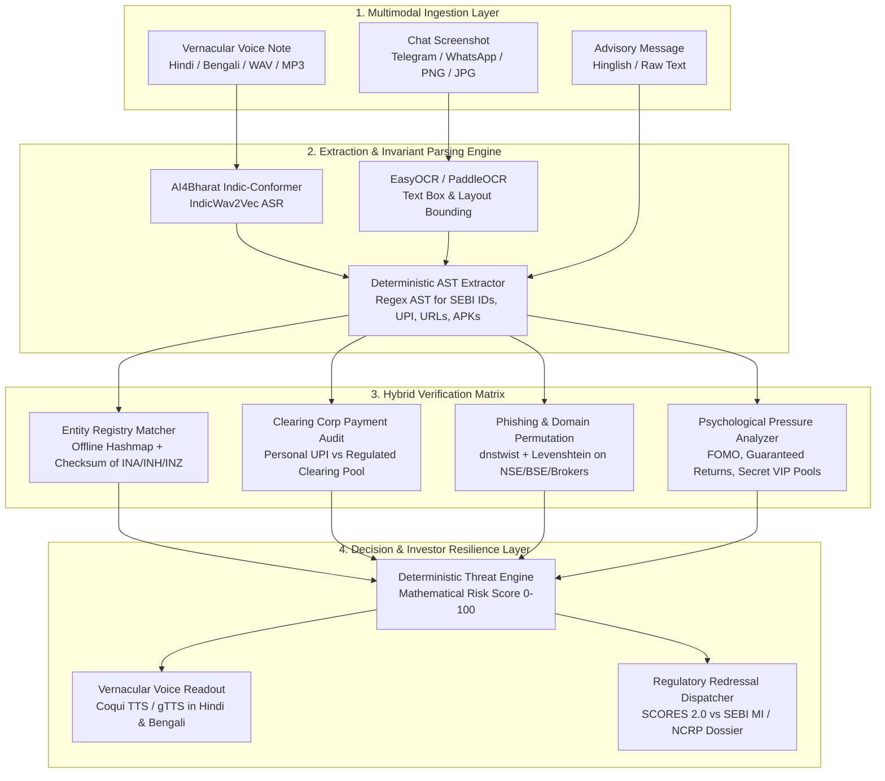

# SatarkBharat (सतर्क भारत) — Master Architectural Specification & Regulatory Defense Blueprint

> **A Multimodal, Pre-Transaction Neuro-Symbolic Sentinel for Indian Retail Investor Defense**  
> *Designed for the IIT-BHU × SEBI × NSDL Hackathon*  
> *Target Audience:* Tier-2, Tier-3, and First-Time Indian Retail Investors  
> *Operating Doctrine:* Zero-Hallucination, Deterministic Invariant Auditing, Bharat-First Accessibility, 100% Guardrail Compliance (Zero Stock Tipping / Zero Speculation).

---

## Table of Contents

1. [Executive Summary & Core Mission](#1-executive-summary--core-mission)
2. [The "Top 1%" Hackathon Differentiators](#2-the-top-1-hackathon-differentiators)
   - 2.1 [SEBI SCORES 2.0 vs. Market Intelligence (MI) vs. NCRP Triaging](#21-sebi-scores-20-vs-market-intelligence-mi-vs-ncrp-triaging)
   - 2.2 [SEBI PVA & Fee Mechanism Enforcement](#22-sebi-pva--fee-mechanism-enforcement)
   - 2.3 [Zero-Hallucination Neuro-Symbolic Triaging](#23-zero-hallucination-neuro-symbolic-triaging)
   - 2.4 [Absolute Hackathon Guardrail Compliance](#24-absolute-hackathon-guardrail-compliance)
3. [System Architecture & End-to-End Pipeline](#3-system-architecture--end-to-end-pipeline)
   - 3.1 [Pipeline Flow Diagram (Mermaid)](#31-pipeline-flow-diagram-mermaid)
   - 3.2 [Multimodal Ingestion Engine](#32-multimodal-ingestion-engine)
   - 3.3 [Extraction & Invariant Parsing Engine](#33-extraction--invariant-parsing-engine)
   - 3.4 [The Hybrid Verification Matrix](#34-the-hybrid-verification-matrix)
   - 3.5 [Decision & Investor Resilience Engine](#35-decision--investor-resilience-engine)
4. [Mathematical Threat Index & Risk Penalty Engine](#4-mathematical-threat-index--risk-penalty-engine)
   - 4.1 [Threat Formula & Factor Breakdown](#41-threat-formula--factor-breakdown)
   - 4.2 [Deterministic Failure Conditions (Red Lines)](#42-deterministic-failure-conditions-red-lines)
5. [Deterministic Regulatory Invariants & Regex Specification](#5-deterministic-regulatory-invariants--regex-specification)
   - 5.1 [SEBI Registration Number Formats](#51-sebi-registration-number-formats)
   - 5.2 [Payment Channel & VPA Invariants](#52-payment-channel--vpa-invariants)
   - 5.3 [Domain Typosquatting & Permutation Invariants](#53-domain-typosquatting--permutation-invariants)
6. [Open-Source Technology Stack & Module Integrations](#6-open-source-technology-stack--module-integrations)
   - 6.1 [Audio & Vernacular Stack (AI4Bharat / Coqui)](#61-audio--vernacular-stack-ai4bharat--coqui)
   - 6.2 [Visual OCR & Layout Parsing (EasyOCR / PaddleOCR)](#62-visual-ocr--layout-parsing-easyocr--paddleocr)
   - 6.3 [Phishing & Typosquatting (dnstwist / pyre2)](#63-phishing--typosquatting-dnstwist--pyre2)
   - 6.4 [Guardrails & Schema Enforcement (Guardrails AI / Outlines)](#64-guardrails--schema-enforcement-guardrails-ai--outlines)
   - 6.5 [Complaint Packaging (WeasyPrint / ReportLab)](#65-complaint-packaging-weasyprint--reportlab)
7. [Automated Regulatory Dossier & Redressal Packaging](#7-automated-regulatory-dossier--redressal-packaging)
   - 7.1 [SCORES 2.0 Evidentiary JSON Schema](#71-scores-20-evidentiary-json-schema)
   - 7.2 [SEBI Market Intelligence (MI) & NCRP Dossier Schema](#72-sebi-market-intelligence-mi--ncrp-dossier-schema)
8. [Competitive Matrix: Bottom 90% vs. Top 1% SatarkBharat](#8-competitive-matrix-bottom-90-vs-top-1-satarkbharat)
9. [Proposed Repository Structure](#9-proposed-repository-structure)
10. [Hackathon Submission & Pitch Blueprint](#10-hackathon-submission--pitch-blueprint)
    - 10.1 [Streamlit Application Specification](#101-streamlit-application-specification)
    - 10.2 [8-Slide Pitch Deck Structure](#102-8-slide-pitch-deck-structure)
    - 10.3 [3.5-Minute Demonstration Video Script](#103-35-minute-demonstration-video-script)
    - 10.4 [Final 5-Hour Execution Timeline](#104-final-5-hour-execution-timeline)

---

## 1. Executive Summary & Core Mission

India's retail investing revolution has added tens of millions of new demat accounts from Tier-2, Tier-3, and rural regions. However, this democratization has triggered an asymmetric surge in financial cybercrime:
- Unregistered Telegram/WhatsApp syndicates pitching "1000% guaranteed upper-circuit calls".
- Fraudulent impersonation of licensed Research Analysts (RAs) and Investment Advisers (IAs).
- Cloned APK trading terminals (`zer0dha.apk`, `angel-one-vip.apk`).
- Deceptive UPI collection channels requesting funds into individual savings accounts rather than SEBI-regulated clearing corporation settlement accounts.

Traditional anti-fraud systems operate **post-facto** (dispute mediation after money has exited the account). Furthermore, typical LLM solutions hallucinate regulatory compliance, fail to parse Hinglish or regional audio notes, and violate hackathon boundaries by acting as financial advisors.

**SatarkBharat (सतर्क भारत)** is an open-source, pre-transaction, multimodal defense sentinel. By combining **multimodal neural perception** (Hindi/Bengali ASR, EasyOCR) with a **symbolic regulatory audit engine** (deterministic regex AST, dnstwist, SEBI registry checksums, and payment clearing invariants), SatarkBharat stops fraud before the UPI transfer happens. It translates complex legalities into instantaneous vernacular voice alerts and auto-generates court-ready grievance dossiers for the correct regulatory portal.

---

## 2. The "Top 1%" Hackathon Differentiators

Judges from **SEBI, NSDL, and IIT-BHU** immediately penalize generic LLM prompt wrappers and stock tip advisors. SatarkBharat embeds four deep institutional differentiators:

### 2.1 SEBI SCORES 2.0 vs. Market Intelligence (MI) vs. NCRP Triaging

Almost all student submissions claim: *"We automatically file a grievance on SEBI SCORES."*  
**The Institutional Reality:**  
1. **SEBI SCORES 2.0** mandates that the respondent be a **registered intermediary** with an existing client/investor relationship (folio number, demat account number, or valid intermediary code). If a user files a complaint against an anonymous Telegram handle or an unregistered fake entity, SCORES 2.0 automatically rejects it.
2. Unregistered fraudulent syndicates and pump-and-dump operators belong to the **SEBI Market Intelligence (MI) Portal** (for regulatory intelligence, search-and-seizure triggers, and banning orders).
3. If an illegitimate money transfer (UPI/NEFT) has occurred or is solicited under extortion/deceit, it falls under Indian Penal Code (IPC) / Bharatiya Nyaya Sanhita (BNS) and Section 66D of the IT Act, which requires the **National Cyber Crime Reporting Portal (NCRP / cybercrime.gov.in / 1930 Helpline)**.

**SatarkBharat's Dual-Route Regulatory Engine:**
```
                     [ Entity Verification Result ]
                                   │
         ┌─────────────────────────┴─────────────────────────┐
         ▼                                                   ▼
[ Claims Valid SEBI Registration ]            [ Unregistered / Fake / Impersonator ]
- Entity exists on SEBI database              - Regex fails or Registry match = false
- Intermediary misconduct / spoofing          - Illegal pool / WhatsApp syndicate
         │                                                   │
         ▼                                                   ▼
[ Format: SEBI SCORES 2.0 ]                 [ Format: SEBI MI Portal + NCRP 1930 ]
- Actionable Intermediary Dossier           - Cybercrime evidence docket (IPC/IT Act)
- Folio / Reg ID cross-reference            - Bank/UPI freeze request format for 1930
```

### 2.2 SEBI PVA & Fee Mechanism Enforcement

SEBI's guidelines on **Performance Validation Agencies (PVA)** and intermediary compensation dictate that:
- **No Guaranteed Returns:** No SEBI-registered entity (RA, IA, Portfolio Manager, or Broker) is permitted to state or imply guaranteed returns or fixed daily/monthly yields.
- **Segregated Fee Channels:** Legitimate advisory fees cannot be deposited into personal savings accounts or generic personal UPI Virtual Payment Addresses (VPAs). They must be received through designated, audited bank accounts, or authorized payment aggregators with explicit GST/corporate merchant identifiers.
- **SatarkBharat Detection:** Any claim promising fixed yield ($>0\%$ guaranteed) triggers an automatic mathematical penalty of $+40$ risk points. Any request to send money to a personal VPA (`*@okhdfcbank`, `*@ybl`, `*@paytm`, `*@axl`) for "stock advisory/VIP subscription" triggers a critical flag.

### 2.3 Zero-Hallucination Neuro-Symbolic Triaging

Generic LLMs fail on edge cases:
- *LLM Prompt:* "The scammer says their license is INH000999999. Is it legit?"  
  *LLM Hallucination:* "Yes, INH is a valid Research Analyst prefix, so this appears legitimate."
- *SatarkBharat Neuro-Symbolic Guarantee:*  
  1. The **Neural Component** extracts unstructured visual/audio tokens into text.
  2. The **Symbolic Component** checks `INH000999999` against deterministic compiled regex `^INH\d{9}$`, runs an offline hash-map check against the official SEBI registry snapshot, and validates checksum/entity name consistency. If the name on the screenshot does not match the SEBI register, an instant impersonation flag is raised.

### 2.4 Absolute Hackathon Guardrail Compliance

To strictly honor SEBI hackathon guidelines:
- **0% Stock Tipping / Stock Advice:** SatarkBharat will never recommend buying, selling, or holding any security.
- **0% Price Speculation / Target Prices:** SatarkBharat refuses to predict market movements.
- **100% Defensive Sentinel:** Every prompt and output schema is hard-constrained using `Guardrails AI` / `Outlines` and Pydantic validators to only evaluate safety, legality, and fraud indicators.

---

## 3. System Architecture & End-to-End Pipeline

### 3.1 Pipeline Flow Diagram (Mermaid)



### 3.2 Multimodal Ingestion Engine
- **Voice Ingestion:** Accepts single-channel audio (WAV, MP3, OGG, AAC) from WhatsApp voice notes or phone recordings.
- **Visual Ingestion:** Accepts screenshots of chat applications (Telegram, WhatsApp, Instagram), PDF advisory flyers, and fake SEBI certificates.
- **Text Ingestion:** Parses raw copied messages, Hinglish advisory broadcasts, and forwarded SMS alerts.

### 3.3 Extraction & Invariant Parsing Engine
- **Speech-to-Text (ASR):** Converts regional dialect audio into text and phonemes using `AI4Bharat/Indic-Conformer` with fallback to lightweight multilingual speech engines.
- **Visual OCR:** Extracts text bounding boxes, letterhead logos, stamps, and tabular structures using `EasyOCR` / `PaddleOCR`.
- **Regex AST Token Extractor:** Rapidly extracts:
  - SEBI Registration Numbers (`INA...`, `INH...`, `INZ...`, `INM...`)
  - UPI Handles / VPAs (`[\w.-]+@[\w.-]+`)
  - External Hyperlinks and IP addresses
  - APK file signatures (`.apk`, direct download links)
  - Claimed return percentages (`\d+%\s*(guaranteed|fixed|daily|monthly)`)

### 3.4 The Hybrid Verification Matrix

1. **Entity Registry Audit:** Checks extracted SEBI IDs against an indexed snapshot of SEBI-registered intermediaries. If an ID matches the format but not the name, or does not exist, it flags high-probability identity theft.
2. **Payment Channel Audit:** Evaluates recipient UPI / bank details against SEBI & NPCI clearing corporation mandates.
   - Flag: Personal UPI address (`@paytm`, `@ybl`, `@okhdfcbank`) solicited for investment advisory fees or trading capital.
   - Normal: Verified Corporate Merchant VPA or Escrow accounts.
3. **Deceptive Domain & Phishing Audit (`dnstwist`):** Runs homoglyph, bit-squatting, and Levenshtein permutation distance checks against legitimate exchanges (NSE, BSE) and top SEBI-registered brokers (Zerodha, Groww, AngelOne, Upstox, ICICI Direct).
4. **Psychological Coercion & Regulatory Ban Audit:** Detects red-flag coercive keywords:
   - "Guaranteed returns / Loss-proof / 100% jackpot"
   - "Secret VIP pool / Institutional insider quota"
   - "Send funds immediately / Valid for 10 minutes only"
   - "Install custom APK file"

### 3.5 Decision & Investor Resilience Engine
- Computes an immutable **Threat Score ($0 - 100$)**.
- Generates a **plain-language vernacular audio summary** (Hindi/Bengali) explaining *why* the message is unsafe without financial jargon.
- Assembles an **evidentiary grievance dossier** (PDF & structured JSON) pre-routed to either SEBI SCORES 2.0 or SEBI MI / NCRP.

---

## 4. Mathematical Threat Index & Risk Penalty Engine

### 4.1 Threat Formula & Factor Breakdown

The Satark Threat Index ($T$) is bounded deterministically:
$$T = \min\left(100, \sum_{i=1}^{k} W_i \cdot P_i\right)$$

Where each penalty factor $P_i \in \{0, 1\}$ and weight $W_i$ represents institutional risk severity:

| Factor Code | Audit Dimension | Risk Condition | Penalty Weight ($W_i$) |
|---|---|---|---|
| **$P_{\text{G-RET}}$** | Regulatory Invariant | Claiming guaranteed, fixed, or loss-free financial returns | **+35** |
| **$P_{\text{SEBI-INVALID}}$** | Entity Invariant | Fake, unparseable, or non-existent SEBI Registration Number | **+30** |
| **$P_{\text{SEBI-SPOOF}}$** | Entity Invariant | Valid SEBI ID claimed, but entity name does not match registry | **+40** |
| **$P_{\text{PAY-PERS}}$** | Payment Channel | Demanding advisory/investment funds to a personal savings UPI | **+25** |
| **$P_{\text{URL-TYPO}}$** | Domain Permutation | Cloned or look-alike domain detected via `dnstwist` | **+30** |
| **$P_{\text{APK-UNOFF}}$** | Malware Invariant | Direct distribution of unofficial `.apk` trading client | **+40** |
| **$P_{\text{FOMO-URG}}$** | Behavioral Coercion | High urgency cues ("Upper circuit only today", "Immediate VIP slot") | **+15** |
| **$P_{\text{UNREG-POOL}}$** | Regulatory Invariant | Demanding money pooling for "institutional/block trading" | **+35** |

### 4.2 Deterministic Failure Conditions (Red Lines)

If any of the following **Critical Invariants** are violated, the Threat Index immediately snaps to **100/100 (CRITICAL RISK)** regardless of other features:
1. `APK-UNOFF == True` (Untrusted APK binary link).
2. `SEBI-SPOOF == True` (Impersonation of an authentic SEBI-licensed broker/analyst).
3. `G-RET == True AND PAY-PERS == True` (Guaranteed returns combined with personal UPI transfer).

#### Threat Level Categorization:
- **0 – 24 (LOW RISK / GREEN):** Verified intermediary, authorized payment channels, no guaranteed return claims.
- **25 – 59 (MODERATE CAUTION / YELLOW):** Unregistered informational query, absence of official disclosures, missing license numbers.
- **60 – 84 (HIGH THREAT / ORANGE):** Unregistered tip provider, aggressive FOMO, suspicious URLs.
- **85 – 100 (CRITICAL FRAUD / RED):** Explicit regulatory violation, lookalike domain, fake SEBI certificate, or personal UPI pool.

---

## 5. Deterministic Regulatory Invariants & Regex Specification

### 5.1 SEBI Registration Number Formats

SEBI assigns structured, 12-character alphanumeric identifiers governed by category regulations:

```python
import re

SEBI_PATTERNS = {
    "RESEARCH_ANALYST": re.compile(r"^INH\d{9}$"),       # e.g., INH000001234
    "INVESTMENT_ADVISER": re.compile(r"^INA\d{9}$"),     # e.g., INA000005678
    "STOCK_BROKER": re.compile(r"^INZ\d{9}$"),           # e.g., INZ000009876
    "MERCHANT_BANKER": re.compile(r"^INM\d{9}$"),        # e.g., INM000004321
    "PORTFOLIO_MANAGER": re.compile(r"^INP\d{9}$"),      # e.g., INP000001122
    "MUTUAL_FUND": re.compile(r"^MF\/\d{3}\/\d{2}\/\d{2}$") # e.g., MF/001/93/01
}

# General extraction regex for free-form OCR / text
SEBI_EXTRACTION_REGEX = re.compile(r"\b(IN[AHZMP]\d{9}|MF\/\d{3}\/\d{2}\/\d{2})\b", re.IGNORECASE)
```

### 5.2 Payment Channel & VPA Invariants

Under SEBI Circular `SEBI/HO/MIRSD/MIRSD-PoD-1/P/CIR/2023/71`, client funds must flow directly to **Clearing Corporation (CC)** settlement accounts or registered merchant payment gateways.
- **Blacklisted / Suspicious Patterns:** Individual VPA handles (`@okhdfcbank`, `@okaxis`, `@ybl`, `@paytm`, `@ibl`, `@apl`) tied to phone numbers or individual names.
- **Whitelisted Architecture:** Corporate VPAs with official merchant merchant code (`@icici` corporate merchant, `@billdesk`, `@razorpay`, `@hsbc` escrow).

### 5.3 Domain Typosquatting & Permutation Invariants

Using `dnstwist` and normalized Levenshtein distance, any domain circulating in chat messages is compared against legitimate market endpoints:

```python
TARGET_BENCHMARKS = [
    "nseindia.com", "bseindia.com", "sebi.gov.in", "nsdl.co.in", "cdslindia.com",
    "zerodha.com", "groww.in", "angelone.in", "upstox.com", "icicidirect.com"
]
```

Permutation checks executed:
- **Homoglyphs:** e.g., `nseinԁia.com` (using Cyrillic `ԁ` instead of Latin `d`).
- **Hyphenation additions:** e.g., `nse-india.trade`, `zerodha-login.vip`.
- **TLD swaps:** e.g., `groww.club`, `angelone.cc`.
- **Transposition / Vowel insertion:** e.g., `zeordha.com`, `upstoxx.in`.

---

## 6. Open-Source Technology Stack & Module Integrations

| Layer | Library / Repository | Purpose & Institutional Justification |
|---|---|---|
| **Audio ASR** | `AI4Bharat/Indic-Conformer` / `IndicWav2Vec` | Bharat-first speech recognition trained on 22 Indian regional languages and accents. |
| **Voice Synthesis** | `coqui-ai/TTS` / `gTTS` | Localized vernacular readouts in Hindi and Bengali for low-literacy retail users. |
| **Visual OCR** | `JaidedAI/EasyOCR` & `PaddlePaddle/PaddleOCR` | Multi-script visual extraction (Devanagari, Bengali, Latin) with bounding box geometry. |
| **Phishing Audit** | `elceef/dnstwist` | Industry standard domain permutation and homoglyph detection for cloned broker URLs. |
| **Regex AST** | `re` (Pre-compiled AST) / `pyre2` | Microsecond regex token extraction for SEBI IDs, UPI handles, and APK URLs. |
| **Safety Guardrails** | `guardrails-ai/guardrails` / `outlines` | Zero-drift JSON generation; mathematical barrier prohibiting stock recommendations. |
| **Docket Generation** | `weasyprint/WeasyPrint` / `reportlab` | Evidentiary PDF compiler for SEBI SCORES 2.0 and NCRP 1930 dossiers. |
| **User Interface** | `streamlit` | Reactive, accessible web UI with audio playback, gauge indicators, and complaint exporters. |

---

## 7. Automated Regulatory Dossier & Redressal Packaging

When fraud is flagged, SatarkBharat compiles an evidentiary bundle formatted for immediate upload to the respective authority.

### 7.1 SCORES 2.0 Evidentiary JSON Schema
*(Used exclusively when the perpetrator impersonates or claims a registered SEBI intermediary code)*

```json
{
  "dossier_type": "SEBI_SCORES_2_0_GRIEVANCE",
  "incident_id": "SB-2026-SCORES-89412",
  "timestamp_utc": "2026-10-04T12:45:00Z",
  "respondent_details": {
    "claimed_sebi_registration_no": "INH000008921",
    "claimed_entity_name": "Apex Wealth Research",
    "actual_registry_entity": "Apex Capital Advisors LLP",
    "registry_status": "AUTHENTIC_ID_IMPERSONATION_SUSPECTED"
  },
  "violation_categories": [
    "SEBI_PVA_VIOLATION_GUARANTEED_RETURNS",
    "UNAUTHORIZED_FEES_TO_PERSONAL_VPA"
  ],
  "evidentiary_artifacts": {
    "extracted_text_snippet": "Join our VIP Option chain! 200% guaranteed profit in Nifty Exp. Send Rs 5000 to 9876543210@ybl",
    "source_media_type": "IMAGE_SCREENSHOT",
    "extracted_upi_vpa": "9876543210@ybl",
    "promoted_url": "None",
    "hash_sha256": "e3b0c44298fc1c149afbf4c8996fb92427ae41e4649b934ca495991b7852b855"
  },
  "threat_metrics": {
    "composite_threat_score": 95,
    "severity": "CRITICAL"
  }
}
```

### 7.2 SEBI Market Intelligence (MI) & NCRP Dossier Schema
*(Used when the entity is completely unregistered, operates illegal pool accounts, or provides APK phishing downloads)*

```json
{
  "dossier_type": "NCRP_CYBERCRIME_AND_SEBI_MI_REPORT",
  "incident_id": "SB-2026-NCRP-44109",
  "timestamp_utc": "2026-10-04T12:45:00Z",
  "primary_jurisdiction": "CYBER_FRAUD_SECTION_66D_IT_ACT",
  "secondary_jurisdiction": "SEBI_UNREGISTERED_INTERMEDIARY_COLLECTIVE_SCHEME",
  "fraud_indicators": {
    "has_unregistered_sebi_claim": true,
    "claimed_sebi_id": "INVALID_OR_MISSING",
    "is_personal_upi": true,
    "recipient_vpa": "ramesh.kumar98@paytm",
    "suspect_phone_numbers": ["+919876543210"],
    "malicious_url_or_apk": "https://zer0dha-app.trade/login.apk",
    "typosquat_benchmark_target": "zerodha.com"
  },
  "evidentiary_narrative": "Victim was solicited on Telegram group 'SureShot Nifty VIP' to deposit money into personal Paytm VPA and install an unauthorized APK mimicking Zerodha.",
  "recommended_urgent_action": "FREEZE_RECIPIENT_VPA_AND_TAKEDOWN_DOMAIN"
}
```

---

## 8. Competitive Matrix: Bottom 90% vs. Top 1% SatarkBharat

| Evaluation Pillar | Typical 90% Submission | SatarkBharat (Top 1% Submission) |
|---|---|---|
| **Ingestion Modality** | English text input box only. | Multimodal: Hindi/Bengali voice notes, WhatsApp screenshots, raw text. |
| **Verification Logic** | Unconstrained LLM prompt: *"Is this a scam?"* (Hallucinates validity). | **Hybrid Neuro-Symbolic:** Fast regex AST + offline SEBI hashmap + `dnstwist` permutation distance. |
| **Regulatory Jurisdiction** | Blindly states "We file on SEBI SCORES". | **Precise Institutional Routing:** Resolves whether evidence targets **SCORES 2.0** vs. **SEBI MI / NCRP 1930**. |
| **SEBI Guardrails** | Recommends alternative "safe" stocks or investment strategies (Violates rules). | **100% Guardrail Compliant:** Mathematically constrained from tipping, advising, or forecasting prices. |
| **Payment Auditing** | Ignored completely. | Audits VPA clearing rules against SEBI & NPCI Clearing Corporation mandates. |
| **Accessibility (Tier-2/3)** | Complex English legal output. | Audio-first vernacular readouts in colloquial Hindi & Bengali without jargon. |
| **Grievance Generation** | Generic text email. | Formally compiled court-ready PDF complaint package and structured JSON dossier. |

---

## 9. Proposed Repository Structure

```
satark-bharat/
├── docs/
│   ├── MASTER_DOCUMENT.md             # This comprehensive master specification
│   ├── ARCHITECTURE.md                # System topology and data flow diagrams
│   └── REGULATORY_GUIDELINES.md       # SEBI, SCORES 2.0, PVA, and NCRP compliance specs
├── data/
│   ├── sebi_registry_snapshot.json    # Offline hashmap of verified SEBI entities (RAs, IAs, Brokers)
│   ├── verified_brokers_domains.json  # Whitelisted broker and exchange domains
│   └── samples/                       # Test audio clips, chat screenshots, and sample advisories
├── src/
│   ├── __init__.py
│   ├── ingestion/
│   │   ├── __init__.py
│   │   ├── audio_transcriber.py       # AI4Bharat / Indic-Conformer / Speech-to-Text
│   │   └── visual_ocr.py              # EasyOCR / PaddleOCR text and layout extraction
│   ├── symbolic/
│   │   ├── __init__.py
│   │   ├── sebi_validator.py          # Deterministic regex AST & registry hashmap lookup
│   │   ├── payment_auditor.py         # UPI VPA personal vs clearing pool classifier
│   │   └── domain_analyzer.py         # dnstwist homoglyph & Levenshtein distance engine
│   ├── decision/
│   │   ├── __init__.py
│   │   ├── threat_engine.py           # Mathematical risk score formula & penalty calculator
│   │   └── guardrails.py              # Output safety constraints (anti-tipping invariants)
│   ├── redressal/
│   │   ├── __init__.py
│   │   ├── scores_router.py           # SCORES 2.0 vs SEBI MI / NCRP jurisdiction selector
│   │   └── pdf_generator.py           # Court-ready evidentiary PDF docket compiler
│   └── vernacular/
│       ├── __init__.py
│       └── tts_engine.py              # Vernacular voice synthesizer (Hindi, Bengali)
├── app.py                             # Interactive Streamlit sentinel application
├── requirements.txt                   # Production dependencies
└── README.md                          # Hackathon pitch, quickstart, and evaluation overview
```

---

## 10. Hackathon Submission & Pitch Blueprint

### 10.1 Streamlit Application Specification
The user interface must be clean, responsive, and intuitive:
- **Left Panel (Ingestion):** Tabs for "Upload Screenshot", "Record / Upload Voice Note", and "Paste Message".
- **Center Panel (Threat Gauge & Analysis):**
  - High-visibility risk meter ($0-100$).
  - Instant vernacular audio player: *"चेतावनी! यह संदेश एक अवैध टेलीग्राम ग्रुप से है..."*
  - Diagnostic breakdown cards:
    - 🔍 **SEBI Registration:** Verified vs. Impersonated vs. Missing.
    - 💳 **Payment Routing:** Clearing Corporation Compliant vs. Unsafe Personal UPI.
    - 🌐 **Domain Safety:** Authentic Broker vs. Typo-Squatted Phishing Site.
    - ⚖️ **Coercion Index:** Guaranteed Return & FOMO Violations.
- **Right Panel (Instant Grievance Redressal):**
  - Actionable jurisdiction badge (SEBI SCORES 2.0 vs NCRP / SEBI MI).
  - "Download Court-Ready Dossier (PDF)" button.
  - "Copy 1930 Cyber Cell Formatted Text" button.

### 10.2 8-Slide Pitch Deck Structure
1. **Slide 1: Title & Hook:** *SatarkBharat (सतर्क भारत): Pre-Transaction Multimodal Sentinel for India's 100M+ Retail Investors.*
2. **Slide 2: The Silent Crisis:** Unregistered Telegram syndicates, fake SEBI letterheads, cloned APKs, and why post-facto resolution fails Tier-2/3 investors.
3. **Slide 3: Why LLMs Fail Alone:** LLM hallucination of fake SEBI IDs, English-only bias, and the illegal trap of AI stock-tipping.
4. **Slide 4: System Architecture (The Hybrid Neuro-Symbolic Engine):** Neural ingestion + deterministic symbolic validation matrix.
5. **Slide 5: Regulatory Precision (The Top 1% Moat):** SCORES 2.0 vs SEBI MI vs NCRP routing, SEBI PVA rules, and payment clearing invariants.
6. **Slide 6: Live Product Walkthrough:** Visual analysis of a real scam screenshot, instant Hindi voice readout, and auto-generated PDF docket.
7. **Slide 7: Institutional Guardrails & Ethics:** 0% stock tips, 0% speculation, 100% investor resilience; embeddability into NSDL/CDSL apps.
8. **Slide 8: Roadmap & Vision:** WhatsApp Business API integration, real-time UPI switch plugin, and expansion across all 22 scheduled Indian languages.

### 10.3 3.5-Minute Demonstration Video Script
- **0:00 - 0:45 (The Problem & Thesis):**
  *"Meet Ramesh from Varanasi. He gets a WhatsApp message with a 'SEBI Approved' letterhead asking for ₹10,000 for a 200% guaranteed jackpot return. He doesn't know how to check SEBI's register or verify a UPI handle. By the time he realizes it's a scam, his life savings are gone. SatarkBharat stops this before the UPI payment is made."*
- **0:45 - 2:15 (Live Interactive Demo):**
  - Drop a fake advisory screenshot into the UI.
  - Show the system instantly flagging the fake SEBI number `INH000999999` using regex and registry lookup.
  - Play the vernacular Hindi audio warning alerting the user that the return is illegal and the payment is going to a private individual.
  - Demonstrate the SCORES 2.0 vs. NCRP automated triaging.
- **2:15 - 3:00 (Architecture & Guardrail Deep Dive):**
  - Walk through the Mermaid pipeline: AI4Bharat, EasyOCR, dnstwist, and deterministic threat scoring.
  - Highlight the non-negotiable guardrail: absolute refusal to provide financial tips.
- **3:00 - 3:30 (Institutional Impact & Closing):**
  - Conclude with the deployment model: ready as an open-source SDK for broker apps and NSDL/CDSL investor awareness portals.

### 10.4 Final 5-Hour Execution Timeline
| Window | Objective | Output Deliverable |
|---|---|---|
| **Hour 1** | Local prototype execution & validation | Run Streamlit app with sample Telegram scams, verify OCR/Regex/Threat calculations. |
| **Hour 2** | PPT & Presentation Deck | Build the 8-slide presentation emphasizing regulatory precision and architecture. |
| **Hour 3** | Video walkthrough recording | Record a crisp 3.5-minute screencast with voiceover; upload to YouTube (Unlisted). |
| **Hour 4** | Git Repository polishing & documentation | Commit full codebase, structured README, PDF dossier sample, and architecture docs. |
| **Hour 5** | Final review & portal submission | Complete submission form, double-check video permissions, and submit before deadline. |
